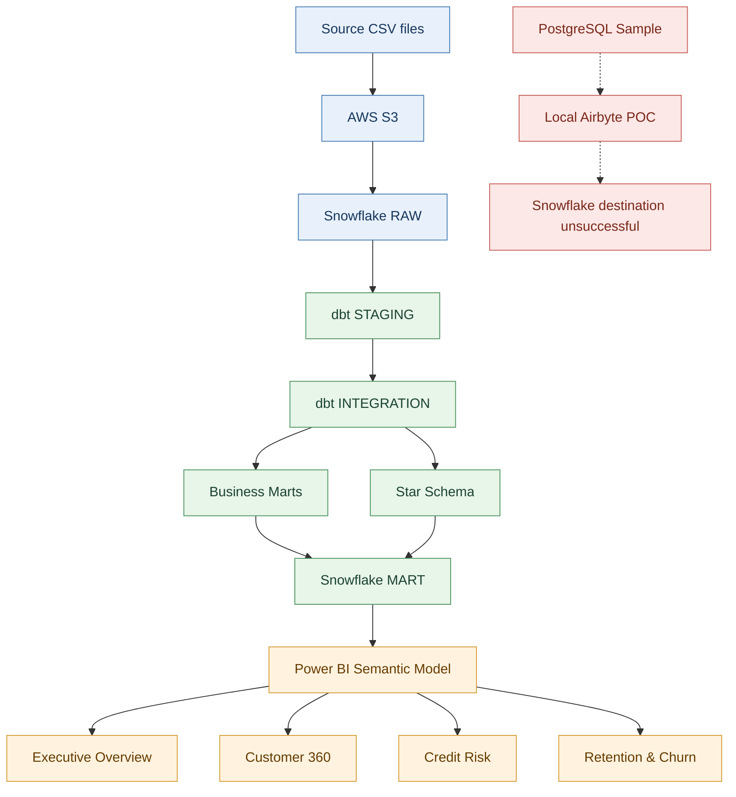

```mermaid
flowchart TB
    A["Source CSV files"] --> B["AWS S3"]
    B --> C["Snowflake RAW"]
    C --> D["dbt STAGING"]
    D --> E["dbt INTEGRATION"]
    E --> F["Business Marts"]
    E --> G["Star Schema"]
    F --> H["Snowflake MART"]
    G --> H
    H --> I["Power BI Semantic Model"]
    I --> J["Executive Overview"]
    I --> K["Customer 360"]
    I --> L["Credit Risk"]
    I --> M["Retention & Churn"]

    N["PostgreSQL Sample"] -.-> O["Local Airbyte POC"]
    O -.-> P["Snowflake destination unsuccessful"]

    classDef data fill:#E8F1FB,stroke:#477DB3,color:#17365D
    classDef dbt fill:#E8F5E9,stroke:#4D9560,color:#1B4332
    classDef bi fill:#FFF3E0,stroke:#D49A35,color:#663C00
    classDef poc fill:#FCE8E6,stroke:#C65D57,color:#7A271A

    class A,B,C data
    class D,E,F,G,H dbt
    class I,J,K,L,M bi
    class N,O,P poc
```