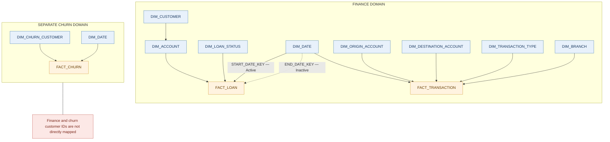

```mermaid
flowchart TB
    subgraph FINANCE["FINANCE DOMAIN"]
        direction TB

        DC["DIM_CUSTOMER"] --> DA["DIM_ACCOUNT"]

        DLS["DIM_LOAN_STATUS"] --> FL["FACT_LOAN"]
        DA --> FL

        DT["DIM_DATE"]
        DT -->|"START_DATE_KEY — Active"| FL
        DT -.->|"END_DATE_KEY — Inactive"| FL

        DOA["DIM_ORIGIN_ACCOUNT"] --> FT["FACT_TRANSACTION"]
        DDA["DIM_DESTINATION_ACCOUNT"] --> FT
        DTT["DIM_TRANSACTION_TYPE"] --> FT
        DB["DIM_BRANCH"] --> FT
        DT --> FT
    end

    subgraph RETENTION["SEPARATE CHURN DOMAIN"]
        direction TB
        DCC["DIM_CHURN_CUSTOMER"] --> FC["FACT_CHURN"]
        DTC["DIM_DATE"] --> FC
    end

    NOTE["Finance and churn customer IDs are not directly mapped"]

    RETENTION --- NOTE

    classDef dimension fill:#E8F1FB,stroke:#477DB3,color:#17365D
    classDef fact fill:#FFF3E0,stroke:#D49A35,color:#663C00
    classDef note fill:#FCE8E6,stroke:#C65D57,color:#7A271A

    class DC,DA,DLS,DT,DOA,DDA,DTT,DB,DCC,DTC dimension
    class FL,FT,FC fact
    class NOTE note
```